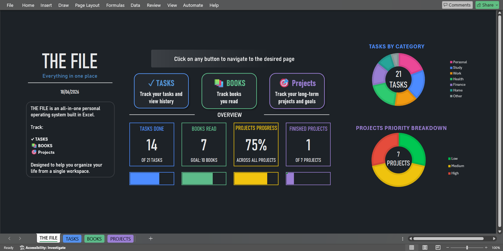
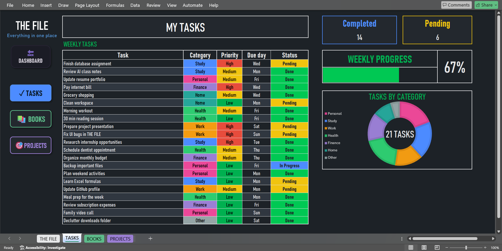
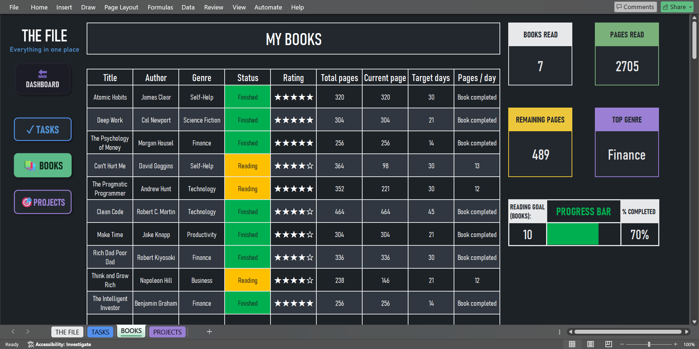
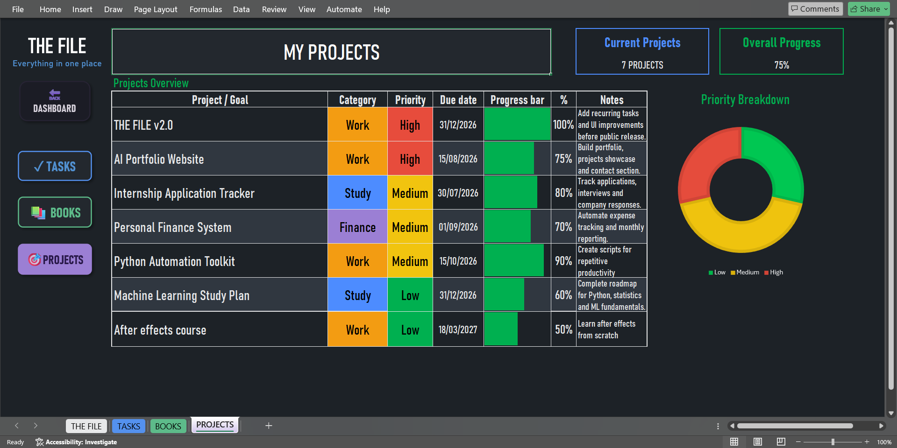

# THE FILE

A modern all-in-one productivity system built in Excel.

THE FILE helps you organize your life from a single workspace by combining task management, book tracking, project monitoring, and visual progress analytics in a clean, easy-to-use interface — no macros, no add-ons, just Excel.

## Features

- Interactive productivity dashboard
- Task management system
- Book tracking and reading goals
- Project planning and monitoring
- Progress bars and visual analytics
- Category-based organization
- Clean, modern interface
- No macros required
- Ready to use out of the box
- Customizable configuration options for advanced Excel users

## Dashboard

The central hub of THE FILE, providing a quick overview of your tasks, books, projects, and progress through interactive charts and key performance indicators.

## Tasks

Track weekly tasks, organize them by category and priority, monitor completion status, and visualize your progress through charts and statistics.

## Books

Manage your reading list, track progress, set reading goals, calculate daily reading targets, and monitor your reading habits.

## Projects

Plan long-term goals, track project progress, assign priorities, and keep notes in a dedicated project management workspace.

## Download

1. Open the [Releases](../../releases) section of this repository.
2. Download the latest version of `THE_FILE.xlsx`.
3. Open the file using Microsoft Excel.
4. Start tracking your tasks, books, and projects.

> **Note:** THE FILE is built for Microsoft Excel. Google Sheets or LibreOffice Calc may not render all charts, conditional formatting, and dashboard elements correctly.

## Customization

THE FILE is designed to work out of the box, but advanced Excel users can customize certain aspects of the workbook to better fit their personal workflow.

To access the configuration settings:

1. Unhide the `CONFIG` worksheet.
2. Remove worksheet protection.
3. Modify the available settings, categories, lists, or other configurable elements according to your preferences.

Changes made in the Config sheet may affect formulas, validations, and dashboard functionality. It is recommended to create a backup copy before making significant modifications.

## Support the Project

THE FILE is free and built mainly to help students and anyone looking for a simple, no-cost way to stay organized. If it's useful to you, consider:

- ⭐ Starring this repository
- 🔄 Sharing it with others
- 💬 Providing feedback and suggestions
- ☕ Supporting future development through a voluntary donation

Donations are entirely optional. THE FILE will always remain free to use.

## License

This project is licensed under **CC BY-NC-SA 4.0** (Attribution-NonCommercial-ShareAlike).

In short: you're free to use, modify, and share THE FILE — even your own modified versions — as long as you give credit and don't sell it. Reselling or repackaging this file (original or modified) for profit is not permitted.

See [LICENSE.md](LICENSE.md) for full details.

---

Copyright © Luis Gtz
